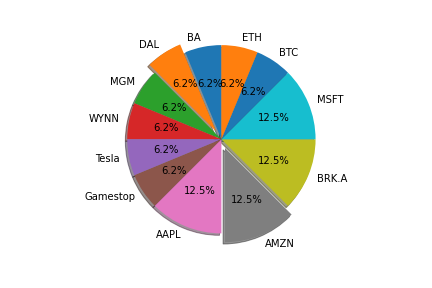
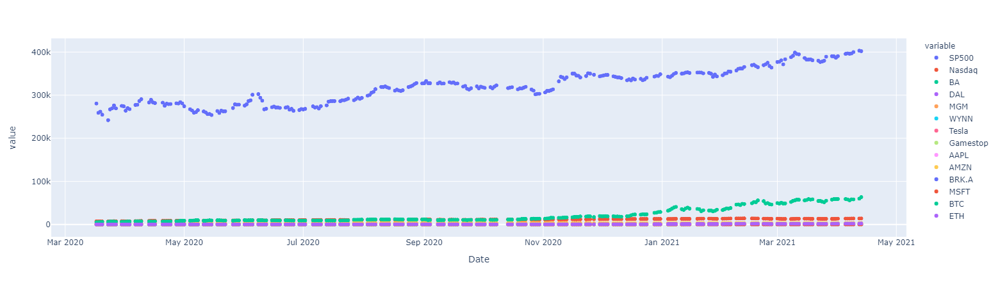
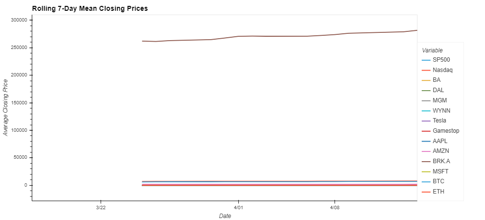

# Covid Capitalism
## Welcome
The Covid-19 Virus sent the world into a global frenzy like never seen before, and perhaps gave birth to the rise of the retail trader. Robinhood made it easy for the average Joe to full blown dive into securities trading, cold turkey. The combination of easy access from apps like Robinhood and the market conditions of the global Coronavirus pandemic created a massive shakedown of the stock market. It is March 09, 2020 and you are anxiously watching the impact of the Covid-19 pandemic unfold into society. 

The stock market crash of 2020 has just begun on Monday, with history’s largest point plunge for the Dow Jones Industrial Average (DJIA) up to that date. It was followed by two more record-setting point drops on March 12 and March 16. The stock market crash included the three worst point drops in U.S. stock market history. Amidst the global frenzy, your good buddy, seasoned trading veteran, Jon Raccah is convinced that there is no better time ever to take advantage of the huge drop in share prices and capitalize on this opportunity under the assumption that share prices will rebound sooner rather than later, leading to glorious gains. 

After consulting with John and all things considered, you are convinced that it is indeed the ultimate opportunity to capitalize on chaos and decide to invest $200,000 into the stock market and cryptocurrency on March 17, 2020. You decide to invest half of your portfolio in blue chips to mitigate long term risk, and the other half in crypto currency, volatile stocks, pandemic related airline stocks and pandemic related hospitality stocks. You are locked and loaded, eager to see how your investment plays out, and how soon the economy recovers from the initial shock of the Covid-19 scare.

### Your Portfolio consists of the following:

<dl>
  <dt>Bluechips Total: $100,000</dt>
  <dd>$25,000 APPL</dd>
  <dd>$25,000 MSFT</dd> 
  <dd>$25,000 AMZN</dd>
  <dd>$25,000 BRK.A</dd> 
</dl>

<dl>
  <dt>Cryptocurrency Total: $25,000</dt>
  <dd>$12,500 BTC</dd>
  <dd>$12,500 ETH</dd>
</dl>

<dl>
  <dt>Volatile Stocks Total: $25,000</dt>
  <dd>$12,500 TSLA</dd>
  <dd>$12,500 GME</dd>
</dl>

<dl>
  <dt>Pandemic Crash Airlines Stocks Total: $25,000</dt>
  <dd>$12,500 BA</dd>
  <dd>$12,500 DAL</dd>
</dl>

<dl>
  <dt>Pandemic Crash Hospitality Stocks Total: $25,000</dt>
  <dd>$12,500 MGM</dd>
  <dd>$12,500 WYNN</dd>
</dl>

## Meet The Team ###
      

## Overview
Below is a pie chart showing the percentage distribution of our $200,000 in each individual asset and a plot of the daily closing prices and the rolling 7 day mean closing prices.
 
 
 

## Preliminary Analysis
The first step is to pull all the closing prices for each individual security using Alpaca Keys and Yahoo Finance alongside our two benchmarks for measurement, SP500 and Nasdaq. We create a dataframe containing each individual asset including the two benchmarks to prepare comprehensive analysis.

## All Asset Analysis
The first step is to pull all the closing prices for each individual security using Alpaca Keys and Yahoo Finance alongside our two benchmarks for measurement, SP500 and Nasdaq. We create a dataframe containing each individual asset including the two benchmarks to prepare comprehensive analysis.

## Our Portfolio
Lorem ipsum dolor sit amet, consectetur adipiscing elit. In lorem nisl, porta vel sodales ut, volutpat non felis. Nulla congue massa tincidunt ultricies ultricies. Morbi condimentum ante sed erat finibus placerat. Vestibulum posuere nunc nec tortor tempor rhoncus. Aenean ut erat ante. Integer ultricies libero quis ex aliquet, eu gravida ante facilisis. Curabitur in massa venenatis, tempus est vitae, fringilla sem. Praesent vel dui lacinia, luctus massa fringilla, mattis ligula. Vestibulum tortor elit, ultrices id feugiat eu, tincidunt in nisi.

## Our Performance Measure
Lorem ipsum dolor sit amet, consectetur adipiscing elit. In lorem nisl, porta vel sodales ut, volutpat non felis. Nulla congue massa tincidunt ultricies ultricies. Morbi condimentum ante sed erat finibus placerat. Vestibulum posuere nunc nec tortor tempor rhoncus. Aenean ut erat ante. Integer ultricies libero quis ex aliquet, eu gravida ante facilisis. Curabitur in massa venenatis, tempus est vitae, fringilla sem. Praesent vel dui lacinia, luctus massa fringilla, mattis ligula. Vestibulum tortor elit, ultrices id feugiat eu, tincidunt in nisi.
