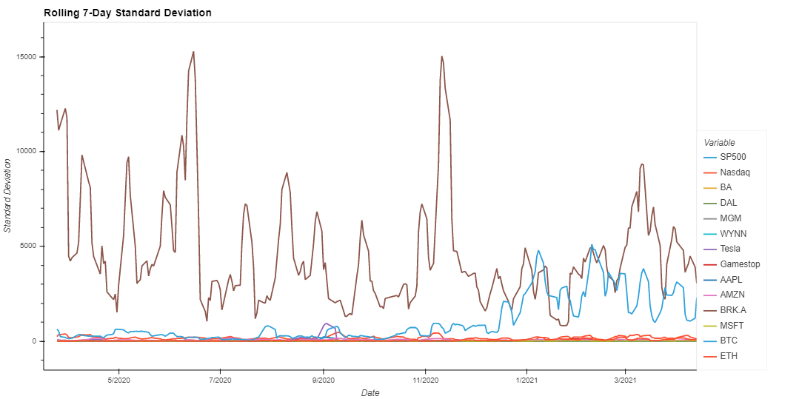
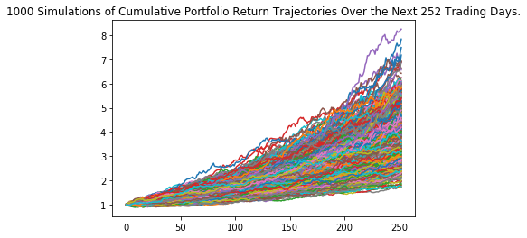
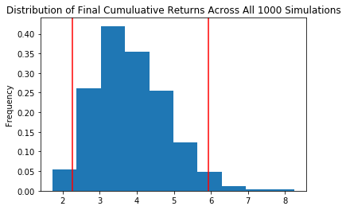
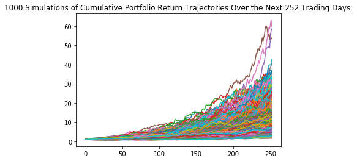
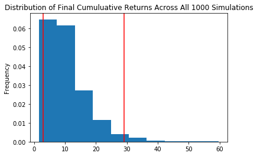
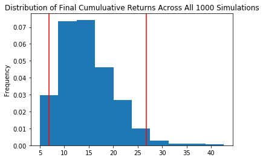
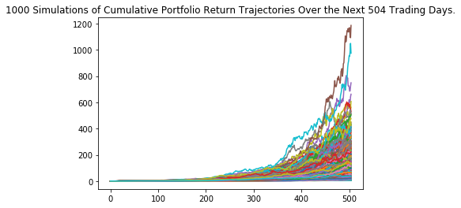
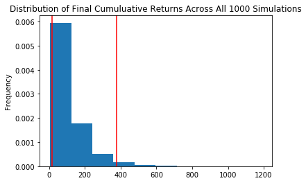

# Covid Capitalism
## Welcome
The Covid-19 Virus sent the world into a global frenzy like never seen before, and perhaps gave birth to the rise of the retail trader. Robinhood made it easy for the average Joe to full blown dive into securities trading, cold turkey. The combination of easy access from apps like Robinhood and the market conditions of the global Coronavirus pandemic created a massive shakedown of the stock market. It is March 09, 2020 and you are anxiously watching the impact of the Covid-19 pandemic unfold into society. 

The stock market crash of 2020 has just begun on Monday, with history’s largest point plunge for the Dow Jones Industrial Average (DJIA) up to that date. It was followed by two more record-setting point drops on March 12 and March 16. The stock market crash included the three worst point drops in U.S. stock market history. Amidst the global frenzy, your good buddy, seasoned trading veteran, Jon Raccah is convinced that there is no better time ever to take advantage of the huge drop in share prices and capitalize on this opportunity under the assumption that share prices will rebound sooner rather than later, leading to glorious gains. 

After consulting with John and all things considered, you are convinced that it is indeed the ultimate opportunity to capitalize on chaos and decide to invest $200,000 into the stock market and cryptocurrency on March 17, 2020. You decide to invest half of your portfolio in blue chips to mitigate long term risk, and the other half in crypto currency, volatile stocks, pandemic related airline stocks and pandemic related hospitality stocks. You are locked and loaded, eager to see how your investment plays out, and how soon the economy recovers from the initial shock of the Covid-19 scare.

### Your Portfolio consists of the following:

<dl>
  <dt>Bluechips Total: $100,000</dt>
  <dd>$25,000 APPL</dd>
  <dd>$25,000 MSFT</dd> 
  <dd>$25,000 AMZN</dd>
  <dd>$25,000 BRK.A</dd> 
</dl>

<dl>
  <dt>Cryptocurrency Total: $25,000</dt>
  <dd>$12,500 BTC</dd>
  <dd>$12,500 ETH</dd>
</dl>

<dl>
  <dt>Volatile Stocks Total: $25,000</dt>
  <dd>$12,500 TSLA</dd>
  <dd>$12,500 GME</dd>
</dl>

<dl>
  <dt>Pandemic Crash Airlines Stocks Total: $25,000</dt>
  <dd>$12,500 BA</dd>
  <dd>$12,500 DAL</dd>
</dl>

<dl>
  <dt>Pandemic Crash Hospitality Stocks Total: $25,000</dt>
  <dd>$12,500 MGM</dd>
  <dd>$12,500 WYNN</dd>
</dl>

## Meet The Team ###

## Overview
Below is a pie chart showing the percentage distribution of our $200,000 in each individual asset and a plot of the daily closing prices and the rolling 7 day mean closing prices.

 
 
 

## Preliminary Analysis
The first step is to pull all the closing prices for each individual security using Alpaca Keys and Yahoo Finance alongside our two benchmarks for measurement, SP500 and Nasdaq. We create a dataframe containing each individual asset including the two benchmarks to prepare comprehensive analysis.

**Analysis:** SP500 is the benchmark, least riskiest least volatile while Tesla and Gamestop lead the pack in volatility.

**Analysis:** The maximum daily return of our portfolio belongs to Gamestop at +136% on January 27, 2021. The minimum daily return also belongs to GameStop at -60% on February 02, 2021. This summarizes the volatility value of Gamestop referenced above.

 

**Analysis:** Analysis: GameStop, ETHC, BTC, MGM, Tesla, WYNN, AMZN, Boeing and Micrsosoft all had higher average cumulative returns than SP500. GameStop,ETH, BTC, MGM, Tesla, WYNN, AMZN all had higher average cumulative returns than Nasdaq. AAPL has the lowest cumulative returns in our portfolio

 

**Analysis:** BTC and ETH have the best return to risk ratios far above SP500 and Nasdaq at 3.76 and 3.39, respectively. AAPL has the lowest sharpe ratio at 0.07, least favorable return to risk.

 

**Analysis:** Analysis: GameStop has the higest standard deviation, most risk. BRK.A has the lowest std and is the least riskiest of our investments. All of our assets are riskier than the SP500.

## Our Portfolio
Next, we create a dataframe containing only the individual assets comprising our portfolio, and assign the weights to calculate the daily returns, cumulative returns and cumulative profit of our portfolio as a whole.

**Analysis:** Our Portfolio's greatest daily return was on March 24, 2020 at +11.18%, and the lowest daily return was on August 31, 2020 as our portfolio fell -13%. 

**Analysis:** As of April 13, 2021 Our Portfolio is worth $762,572.78. A net profit of $567,572.78 off our investment, and a total return of +381.29%

## Our Performance Measure
Next, we created a dataframe containing the daily returns of our portfolio, SP500 and Nasdaq to measure our portfolio’s performance against the benchmarks.

**Analysis:** Our Portfolio Cumulative Returns were greater than both SP500 andNasdaq cumulative returns throughout the entire period.

**Analysis:** Our Portfolio is exponentially riskier than both SP500 and Nasdaq given the volatile nature of our individual investments.

**Analysis:** The covariance between our portfolio and the SP500 is positive andextremely low which means that there is a weak positive relationship between the two. The variance between our portfolio and the SP500 is positive and extremely low also which means that there is low correlation between securities in our portfolio. With a beta value of 1.14, our portfolio is slightly more volatile than the market, approximately 14%.

**Analysis:** Our Portfolio signigficantly Outperformed the Nasdaq which slightly outperformed the SP500. Sharpe ratio of 3.4 is considered excellent and a farabove average risk to return ratio.

## Portfolio Optimization
Next, we measured the returns of our original portfolio versus two optimized versions of our portfolio. In the diversified portfolio, we dropped the two most highly correlated assets (MGM, WYNN).  In the diversified and return-to-risk optimized portfolio, we drop the two most highly correlated assets (MGM, WYNN) and also dropped the three lowest sharpe ratio assets ( BA, DAL, AAPL).  The results are shown below.

**Analysis:** When optimized with less correlation and the dropping of lower sharpe ratios, our returns were astronomical, exponentially greater than our original portfolio.

## Forecasting Analysis

**Analysis**: The chart above illustrates that our normal-weighted portfolio returns range between 172.55% and 825.12%. This means that in 1000 tries, over the span of one year’s worth of trading days, our forecasting algorithm predicts that the worst our portfolio can perform is a return of 172.55% on our investment.

**Analysis:** The chart above illustrates the returns distributed across a range of 1.73 and 8.25, with a mean of 3.84 and the 95% of the returns falling within 2.26 and 5.93. What this essentially means is the portfolio performed very, very well.

**Analysis:** The chart above illustrates that our optimal-weighted portfolio returns range between 157.99% and 5970.47%. This means that in 1000 tries, over the span of one year’s worth of trading days, our forecasting algorithm predicts that if you invest **$10,000** in our optimal-weighted portfolio, in a year’s time you could have **$597,047.04**

**Analysis:** Analysis: The chart above illustrates the returns distributed across a range of **1.57** and **59.70**, with a mean of **10.78** and the **95%** of the returns falling within **2.96** and **29.14** Feel free to draw your own conclusions here.

**Analysis:**  The chart above illustrates that our normal-weighted portfolio returns range between 498.29% and 4256.08%. This means that in 1000 tries, over the span of two years’ worth of trading days, our forecasting algorithm predicts that the worst your portfolio can perform is a return of 498.29% on your investment.

**Analysis:**  The chart above illustrates the returns distributed across a range of 4.98and 42.56, with a mean of 14.71 and the 95% of the returns falling within 6.86 and 26.69. We’ll email a sign-up sheet for our Group 1 Investment Fund following the conclusion of this class.

**Analysis:**  The chart above illustrates that our optimal-weighted portfolio returns range between 555.64% and 118,628.55%. This means that in 1000 tries, over the span of two years’ worth of trading days, our forecasting algorithm predicts that if you invest $10,000 in our optimal-weighted portfolio, in just two years’ time you could have a modest $11,862,855.

**Analysis:**   The chart above illustrates the returns distributed across a range of 5.56 and 1186.29, with a mean of 108.29 and the 95% of the returns falling within 15.28 and 379.16. The only question left is who’s investing first?

# Conclusion
If you failed to take John’s sound advice on March 17, 2020, you quite possibly missed a once in a lifetime opportunity for overnight stock market glory. Our decision to invest $200,000 to creating our portfolio gave us a +381% return on our investment, in just over a year. Our Portfolio is now worth, $762,572.78, with a net profit of $567,572.78. 

The question now remains, can our portfolio sustain at this rate, or should we sell and take our half million-dollar profit to the bank? According to our simulations it would be incompetent and outright foolish to sell off.  Over the span of one year’s worth of trading days, our forecasting algorithm predicts that the worst our portfolio can perform is a return of 172.55% on our investment and could reach over 800%. We are treating John to a steak dinner at the Four Seasons hotel, and gifting him a new Rolex Submariner watch, to discuss strategy going forward.

